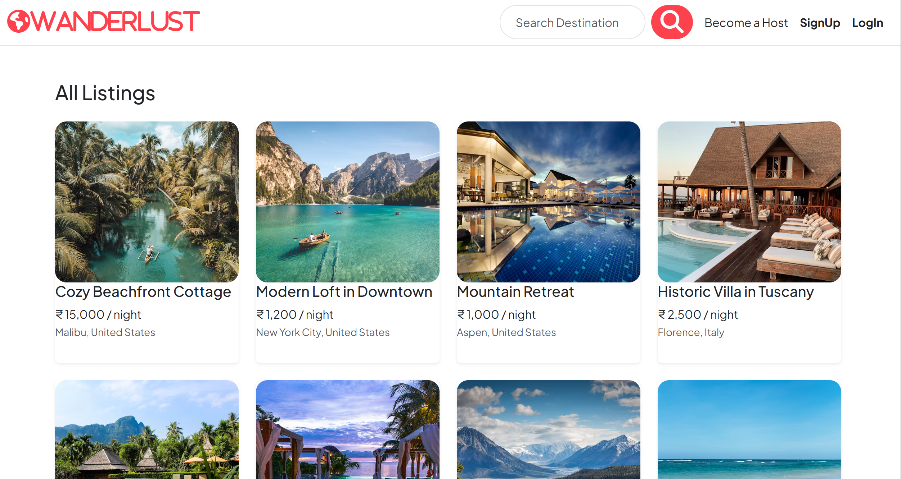

# WanderLust - Travel Listing Web App

WanderLust is a full-stack travel listing web application built with **Node.js**, **Express**, **MongoDB**, and **EJS**. It allows users to view, search, and post travel destinations (listings), and also leave reviews. Authentication is handled using Passport.js.

---

## 🚀 Features

* User signup, login, logout (authentication using Passport.js)
* Flash messages for success and error feedback
* CRUD operations for listings (create, view, update, delete)
* Nested review system for listings
* Search listings by country
* Responsive UI with Bootstrap

---

## 📁 Project Structure

```
wanderlust/
├── models/             # Mongoose schemas (User, Listing, Review)
├── public/             # Static files (CSS, client-side JS)
├── routes/             # Express routers (listing.js, reviews.js, user.js)
├── views/              # EJS templates (partials, pages)
├── app.js              # Main application file
├── package.json        # Project metadata and dependencies
├── .env                # Environment variables (not committed)
└── README.md           # Project documentation
```

---

## ⚙️ Installation

### 1. Clone the Repository

```bash
git clone https://github.com/your-username/wanderlust.git
cd wanderlust
```

### 2. Install Dependencies

```bash
npm install
```

### 3. Set Up Environment Variables

Create a `.env` file in the root directory:

```env
SESSION_SECRET=your_super_secret_key
```


### 4. Start MongoDB

Make sure MongoDB is running locally:

```bash
mongod
```

### 5. Run the App

```bash
node app.js
```

The app will be running at `http://localhost:8080`

---

## 🔐 Authentication

* Passport.js with `passport-local`
* `express-session` for session management
* Flash messages via `connect-flash`

---

## 🌍 Search Feature

* Listings can be filtered by country using a search form.

```html
<form method="GET" action="/listings">
  <input name="country" type="search" placeholder="Search Destination">
</form>
```

---

## 💾 Database

* MongoDB using Mongoose
* Local DB URL: `mongodb://127.0.0.1:27017/wanderlust`

### Collections

* `users`
* `listings`
* `reviews`

---

## 📦 Dependencies

* express
* ejs
* ejs-mate
* mongoose
* passport
* passport-local
* express-session
* connect-flash
* method-override
* dotenv (recommended)

---

## 📝 Scripts

In `package.json`, add:

```json
"scripts": {
  "start": "node app.js"
}
```

Now you can run the app with:

```bash
npm start
```

---

## 🛡️ Security Tips

* Store secrets (like `SESSION_SECRET`) in `.env` file
* Set `cookie.secure = true` if using HTTPS in production
* Use Helmet for security headers (optional)

---

## 👤 Author

**Subham Kumar Shaw**

---

## 📸 Screenshots

Home Page:-




## ✅ To-Do / Improvements

* Add image uploads using Cloudinary/Multer
* Add pagination to listings
* Add Google Maps integration for geolocation

---


Feel free to contribute, fork, or give feedback!
